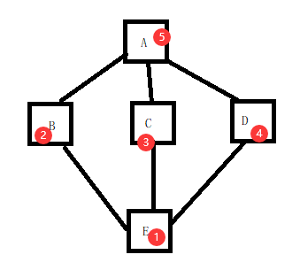
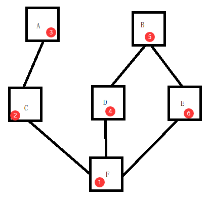

# 面向对象编程

## 继承

类的继承，继承的类可以获取到被继承的方法。

定义一个人类的类，教师也属于人类，那么教师就可以去继承人类，来使用人类的中的方法。

使用继承可以提高代码的重用性。

```python
class Base:
    money = 12

    def say_hi(self):
        print('hello word!')

# 继承Base类
class SubCls(Base):
    pass

a = SubCls()
a.say_hi()

```

## 抽象

在多个类中有公共的方法或者是属性，我们把公共的方法和属性提取出来再创建一个新的类，然后在类中继承这个公共的类，这个过程叫做`抽象`这样可以简化代码。

比如学生类和老师类，老师类有名字和年龄say_hi方法，学生类同样有，那么这个时候创建一个Persional类，然后再由学生和老师继承。

正确使用继承:

1、先抽象再继承。

2、继承一个现有的功能，扩展或者修改原始的功能。

```python


```

## 属性的查找顺序

对象 -> 类 -> 父类


## 派生

派生就是在继承了一个类之后在子类中新写得方法就叫做派生。

我们在继承了父类的功能之后一般都要进行新增方法。

## 覆盖

子类中继承了父类，在子类中拥有相同的属性或者方法，会把父类中的方法或者是属性给覆盖掉。


## 子类中访问父类的内容

三种方法：

```python

```


## 组合

描述两个对象之间是什么关系。

列如学生类和手机类学生用手机打电话这两种不符合继承的关系使用组合更加的合理，还有游戏角色中拥有某些装备。

## 菱形继承

当一个类继承了多个类，多个类又继承了同一个父类。

新形式类和经典类。

任何类都是obj的子类。

新式类: 任何显示或者隐式地继承obj的类叫做新式类，python3中的都是新式类。

经典类: 不是obj的子类，仅在python2中出现。

新式类: 当出现了菱形继承时,新式类,先深度,当遇到了共同父类时就广度 



经典类: 经典类,就是深度优先



