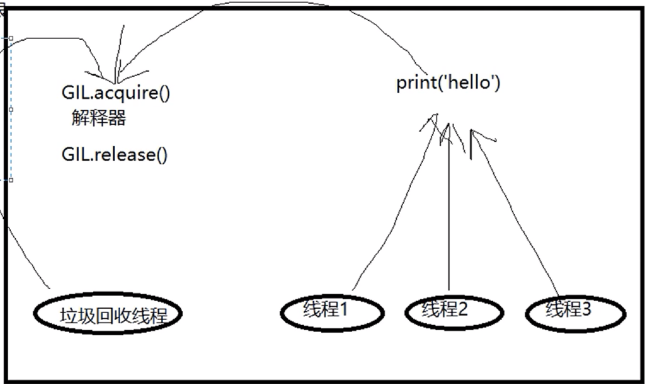

1. GIL是python的特定吗？
不是，是cpython解释器的特点。
2. 单进程无法利用多核心的优势是所有解释型语言的通病。
3. 针对不同的数据应该加不同的锁进行处理。
4. GIL是保证多个线程之间的数据安全的。

## GIL全局解释器锁
在同一个进程中，如果有多个线程，会同时去抢占解释的锁，如果线程有io会自动的释放锁。


```python
from threading import Thread,Lock

n = 100

def task():
    global n
    tmp = n
    # time.sleep(0.1) 如果没有iO使用gil锁一样能实现功能。
    n = tmp - 1

t_list = []
mutex = Lock()
for i in range(100):
    t = Thread(target=task)
    t.start()
    t_list.append(t)

for t in t_list:
    t.join()

print(n)
```

# python多线程

研究python的多线程是否有用需要分情况讨论。
python的多线程是否有用可以根据情况而定。
多进程+多线程配合使用，这样能利用多核优势。

4个任务 计算密集型。
单核情况下，开线程更节省资源。
多核心的情况下，开进程，可以利用多核心优势。

4个任务 IO密集型
单核情况下，开线程更节省资源。
多核情况下，开线程更节省资源。

## 锁

不要轻易处理锁的问题。除非开发底层的架构。

## 信号量

公共厕所，定义多少个坑位，空置的坑位就有线程进去。


## event事件

两个子进程之间等待，一个线程给另外一个线程发信号。

## 线程队列q

用队列处理信息，比自己使用锁去处理数据要好。
